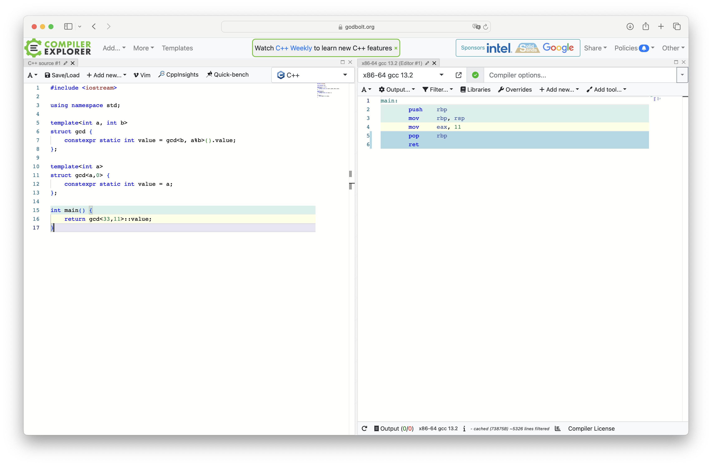

# Set of small c++ codes 

<div align="center">


 
</div>

### New important points by version

### C++ 11 - Language features

#### rvalue references

```cpp
void foo(int& x) {}
void foo(int&& x) {} // For rvalues only
```

#### Move semantics

Moving an object is often cheaper than copying the entire object.

#### Forwarding references (also known as universal references)

Perfect forwarding: the ability to pass arguments while maintaining their value category.

- T& & -> T&
- T& && -> T&
- T&& & -> T&
- T&& && -> T&&

#### Variadic templates

... accepts zero or more arguments. We can then create an initializer list from a parameter pack to iterate over it.

```cpp
template<typename... arguments>
void test {
    auto list = {arguments...};
    for(const auto& e: list) {
        cout << e << endl;
    }
};
```


#### nullptr

Type safe representation of null pointer. It replaces C NULL macro and is of type std::nullptr_t. Implicitly convertible to pointer types.

#### Strongly-typed enums

```c++
enum class Test : int {
    v1 = 0
    v2 = 1
}

auto x = Test::v1; 
```

#### Attributes

Universal syntax for all compilers.

```c++
class [[nodiscard]] my_class{}; // We should not discard the returned type of a function
```

#### Constexpr

Set of expression that could potentially be evaluated by the compiler at compile time. Can be used for variables / functions. There is no guarantee regarding whether or not it will be evaluated at compile time.

```c++
constexpr int fib(int x) {
    assert(x >= 0);
    if(x == 0) return 0;
    return fib(x-1) + fib(x-2);
}
```

#### Delegating constructors

Constructors can now call other constructors in the same class using an initializer list.

#### Explicit virtual overrides

use the override keyword. If the function doesn't override a parent's virtual function, you an throw a compiler error.

#### Final keyword

A virtual function can't be overridden from a derived calls.

#### Default keyword

Elegant and efficient way to provide default initialization of an object.

#### Delete keyword

Elegant and efficient way to provide a deleted implementation of a function.


#### Ranged based for loop

Syntatic sugar over iterator.

```c++
for(const auto& val: container) {
    // Do something here
}
```

#### move constructor and move assignment operator

C++ 11 introduces a new constructor and a new assignment operator for move semantics.

```cpp++
struct A {
    A(A&& other) {} // Move constructor
    A& operator=(A&& other) { // Move assignment operator
        // Do some stuff here
        return *this;
    }
}
```

#### Converting constructors

Converting constructors will convert values of braced list into constructor arguments.

```c++
struct A {
    A(int) {}
    A(int,int) {}
};

A a1 = {0}; // Calls first constructor
A a2 = {0,0}; // Calls second constructor 
```

However if there is a constructor with initializer list, we will use this constructor instead.

```c++
struct A {
    A(int) {}
    A(int,int) {}
    A(std::initializer_list<int>) {}
};

A a1 = {0}; // Calls last constructor
A a2 = {0,0}; // Calls last constructor
```


### Cpp11 stl features

#### std::move

std::move indicates that its resources can be transferred. 

```c++
std::unique_ptr<int> p1 = std::make_unique(new int(1));
std::unique_ptr<int> p2 = std::move(p1);
```

#### Smart pointers

C++11 introduces smart pointers in the stl library

unique pointer isn't copyable but is movable.

weak pointer doesn't modify the reference count of a shared pointer. It can be used to avoid circular dependencies / caching systems.

Pointer should be created with the make_function.

```c++
std:::uniqe_ptr<T> ptr; // Unique pointer
std::shared_ptr<T> ptr; // Shared pointer
```

#### std::thread, std::async

is a standard way to use threads in c++. It provides instructions to start, stop and synchronize between them.

std::async on the othre size runs the given function either asynchronously or lazily evaluated depending on the std::launch policy.  It returns a std::future object.

```c++
int foo() { return 0; }

auto future = std::async([std::launch::async | std::launch::deferred], foo);
std::cout << future.get() << std::endl; // Wait for the result
```

#### std::forward

std::forward allow to keep the value category and cv-qualifiers of an argument.

```c++
void overloaded(const int& x) { cout << "[lvalue] ";}
void overloaded(int&& x) { cout << "[rvalue] ";}

template <typename T>
void function(T&& x) {
    overloaded(x); // Calls first functions
    overloaded(std::forward<T>(x)); // Can call both functions
}
```

#### Unordered containers

Unordered containers are implemented using hashing and therefore have constant-time complexity for search, insertion and deletion. On the other side we don't have ordering.

#### std::chrono

This library can be used to benchmark code.

#### std::to_string
std::to_string converts numeric values in string.

Type traits defines compile mechanism for query properties about types

```c++
std::is_integral<T>::value;
std::conditional<X, double, float>::type;
```

#### std::tuples, std::tie and std::get

Tuples are fixed-sized collection of heterogeneous values. We can access them using std::tie or std::get

```c++
auto t = std::make_tuple(1,"coucou", 1.4);
std::cout << std::get<0>(t) << " " << std::get<0>(t) << " " << std::get<0>(t) << std::endl;
std::tie(v1,v2,v3) = t;
```

#### std::array 

This is a simple array build on top of a C-style array. It supports all the common operations.

#### std::ref

This keyword is used to create object of type std::reference_wrapper that holds a reference of value

#### std::begin(), std::end()

These two functions are used to return begin and end iterator generically and also works with raw arrays.


## Compile time optimizations

Compile time gcd with template metaprogramming




